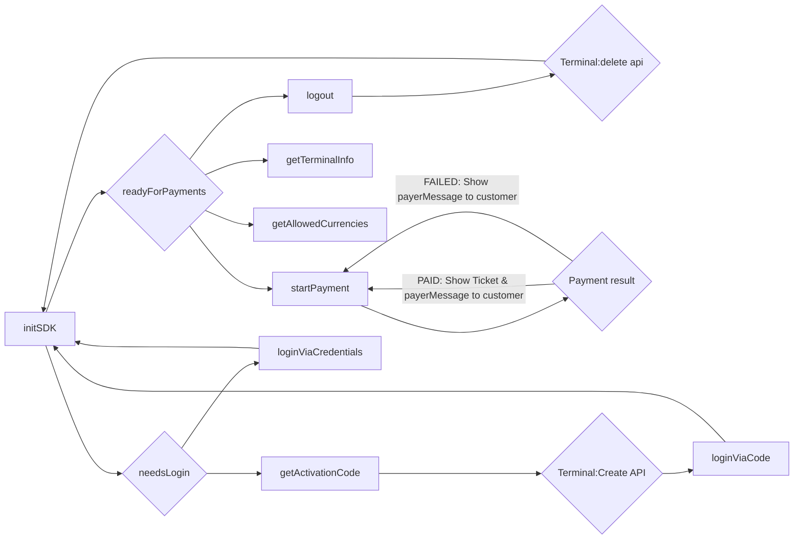

# PAY.POS SDK - Android Softpos

### Requirements:

- Android v8.0 or higher
    - Android security patch is not older than 2 years
- Device support NFC (and is enabled)
- Your project supports Gradle (default for Android apps)
- Make sure you have contacted PayNL support for an `integrationId` (required for initSDK)
- Make sure you have the gradle credentials from PayNL support

### Getting started

To get started, create a `gradle.properties` file in your global gradle file:

- MacOS: `~/.gradle/gradle.properties`
- Windows: `USER_HOME/.gradle/gradle.properties`

```groovy
# Minesec client registry
MINESEC_REGISTRY_LOGIN=...
MINESEC_REGISTRY_TOKEN=...
```

Now that you have set your credentials, go to the root `build.gradle` file and make sure the following is in this file:

```groovy
allprojects {
    repositories {
       google()
       mavenCentral()
       maven { url "https://maven.pkg.github.com/paynl/pos-sdk" }

      maven {
        def MINESEC_REGISTRY_LOGIN = project.MINESEC_REGISTRY_LOGIN
        def MINESEC_REGISTRY_TOKEN = project.MINESEC_REGISTRY_TOKEN

        name = "MineSecMavenClientRegistry"
        url = uri("https://maven.pkg.github.com/theminesec/ms-registry-client")
        credentials {
          username = MINESEC_REGISTRY_LOGIN
          password = MINESEC_REGISTRY_TOKEN
        }
      }
    }
}
```

Last but not least, let's add the SDK to your Android app.
Go to `app/build.gradle` and go to the `dependencies`-section.
In there you can add the PayNL POS SDK via:

```groovy
dependencies {
  debugImplementation "com.paynl.pos:sdk.softpos.staging:0.0.9"
  releaseImplementation "com.paynl.pos:sdk.softpos:0.0.9"
}
```

> [!NOTE]
> Please note, that the `sdk.softpos.staging` uses the Tinpay environment and is safe to use with a real payment card.
> No money will be transferred, but you will get actual responses from the SDK. Perfect during development.
>
> To activate you will need to use a different url for `Terminals:Create`

### SDK flow



### API Spec

#### Init sdk

This function will initialize the SDK. It will return `PayNlInitResult` enum type

| **Name**                                 | **Type**             | **Description**                                                                                                                                                                                                                                                     |
|------------------------------------------|----------------------|---------------------------------------------------------------------------------------------------------------------------------------------------------------------------------------------------------------------------------------------------------------------|
| context                                  | Context              | The current android activity/context                                                                                                                                                                                                                                |
| integrationId                            | String               | The UUID received from PayNL support in order to process payments                                                                                                                                                                                                   |
| overlayParams                            | PaymentOverlayParams | Using these params you can configure the overlay during a payment (Opt-out feature)                                                                                                                                                                                 |
| overlayParams.enabled                    | boolean              | The enables/disables the overlay (default: `true`)                                                                                                                                                                                                                  |
| overlayParams.logoImage                  | int                  | The reference id for your logo (default: `R.drawable.paynl` -> The PayNL logo)                                                                                                                                                                                      |
| overlayParams.waitingCardAnimation       | int                  | The reference id for a lottie json animation shown while waiting for NFC detection. Make sure your [lottie json](http://airbnb.io/lottie/#/android?id=from-resraw-lottie_rawres-or-assets-lottie_filename) is in the raw folder (default: `R.raw.reader_animation`) |
| overlayParams.processingSuccessAnimation | int                  | The reference id for a lottie json animation shown after payment is successfully processed (default: `R.raw.reader_success`)                                                                                                                                        |
| overlayParams.processingErrorAnimation   | int                  | The reference id for a lottie json animation shown after an error occured (default: `R.raw.reader_error`)                                                                                                                                                           |
| overlayParams.progressBarColor           | String               | The color of the loading spinner during processing of Payment. Hex-only (default: `#585FFF`)                                                                                                                                                                        |
| overlayParams.cancelButtonLabel          | String               | The label text on the cancel button (default: `Annuleren`)                                                                                                                                                                                                          |
| overlayParams.waitingCardLabel           | String               | The label text while waiting for NFC detection (default: `Bied uw kaart aan`)                                                                                                                                                                                       |
| overlayParams.processingCardLabel        | String               | The label text while processing payment (default: `Betaling verwerken...`)                                                                                                                                                                                          |
| useExternalDisplayIfAvailable            | boolean              | This will make sure the overlay and PIN prompt is show on the secondary screen, if a secondary screen is available (default: `true`)                                                                                                                                |
| enableSound                              | boolean              | During a transaction, some user feedback is required to improve the User Experience. Example are: NFC scan beep or payment success beep. The SDK has a build-in tone generator which uses the phone's volume to generate the correct sounds (default: `true`)       |
| enableLogging                            | boolean              | If problems occure, PayNL support needs logs from the SDK to help you out. This feature can be disabled for minor performance improvements, BUT NO SUPPORT CAN BE GIVEN IF THIS FEATURE IS DISABLED (default: `true`)                                               |

##### Example

```java
package com.paynl.example;

import android.content.Context;

import com.paynl.pos.sdk.PosService;
import com.paynl.pos.sdk.shared.models.paynl.PayNlInitResult;
import com.paynl.pos.sdk.shared.payment.PaymentOverlayParams;

class PayNLService {
  private static final String integrationId = "";
  private static final String licenseName = "";
  private static final PaymentOverlayParams overlayParams = null;
  private static final boolean useExternalDisplayIfAvailable = true;
  private static final boolean enableSound = true;
  private static final boolean enableLogging = true;
  
  private final PosService posService;
  
  public Example(Context context) {
    this.posService = new PosService(context, integrationId, licenseName, overlayParams, useExternalDisplayIfAvailable, enableSound, enableLogging);
    // ... OR ...
    // this.posService = new PosService(context);
  }
    
  public void initSdk() {
    // If the big PosService constructor is not used
    // Uncomment the following setConfiguration method
    // this.posService.setConfiguration(integrationId, licenseName, overlayParams, useExternalDisplayIfAvailable, enableSound, enableLogging);

    PayNlInitResult initResult = this.posService.initSdk();
    switch (initResult) {
      case needsLogin:
        // Start login flow
        break;
      case readyForPayments:
        // SDK is ready to start payments
        break;
      case failed:
        // Something went wrong during initSDK. Please consult logcat to see why
        break;
    }
  }
}
```

#### Get activation code

> [!WARNING]
> Only use this if the `initSdk` method returned `.needsLogin`.
> Otherwise this method will log out this device, and you will be forced to activate this activation code

This function will register this device and get an activation code to be activated
via [Terminals:create](https://developer.pay.nl/reference/post_terminals).
This function does not take parameters and has the following return type: `PayNlActivationResponse`:

| **Name**             | **Type** | **Description**                                               |
|----------------------|----------|---------------------------------------------------------------|
| `response`           | object   |                                                               |
| `response.code`      | String   | The activation code to be used in the `Terminals:create` call |
| `response.expiresAt` | Date     | This activation response is valid till this date              |

##### Example

```java
import android.util.Log;

import com.paynl.pos.sdk.shared.models.paynl.PayNlActivationCode;

class PayNLService {

  // ...
  
  public PayNlActivationCode getActivationCode() {
    try {
      return this.posService.getActivationCode();
    } catch (SVErrorBaseException e) {
      Log.e("PayNLExample", String.format("Failed to fetch activation code - code: %s, description: %s", e.code, e.description));
      return null;
    }
  }
}
```

#### loginViaCode

> [!NOTE]
> This method requires the usage of `getActivationCode`

> [!NOTE]
> After completing this method, you need to re-invoke the `initSdk` function

> [!NOTE]
> While using `sdk.softpos.staging`, you will need to use https://rest.tinpay.nl as base URL for `Terminals:Create`

After using the `getActivationCode` and [Terminals:create](https://developer.pay.nl/reference/post_terminals), you can
use this `loginViaCode`.
It does not have a return type, but you need to provide the code from the `getActivationCode` to complete the login.

##### Example

```java
import android.util.Log;

class PayNLService {

  // ...
  
  public boolean loginViaCode(String code) {
    try {
      this.posService.loginViaCode(code);
      return true;
    } catch (SVErrorBaseException e) {
      Log.e("PayNLExample", String.format("Failed to activate SDK with activation code - code: %s, description: %s", e.code, e.description));
      return false;
    }
  }
}
```

#### loginViaCode

> [!WARNING]
> Only use this if the `initSdk` method returned `.needsLogin`.
> Otherwise this method will log out this device and reactivate using your account

> [!NOTE]
> After completing this method, you need to re-invoke the `initSdk` function

> [!NOTE]
> While using `sdk.softpos.staging`, you will need to use https://rest.tinpay.nl as base URL for the API's below

An alternative way to activate your device is via your PayNL account.
For this you need your a-code, service code, and service secret.

These codes can be found in the PayNL dashboard or using the
API: [Account:Me](https://developer.pay.nl/reference/accounts_me_get)
and [Merchant:info](https://developer.pay.nl/reference/merchants_info).

##### Example

```java
import android.util.Log;

class PayNLService {

  // ...
  
  public boolean loginViaCredentials(String aCode, String serviceCode, String serviceSecret) {
      try {
          this.posService.loginViaCredentials(aCode, serviceCode, serviceSecret);
          return true;
      } catch (SVErrorBaseException e) {
          Log.e("PayNLExample", String.format("Failed to activate SDK with credentials - code: %s, description: %s", e.code, e.description));
          return false;
      }
  }
}
```

#### Get terminal info

With an activated terminal, you can fetch some basic information for reporting or other use cases.

The available information is the following:

| **Name**                      | **Type** | **Description**                                                                                         |
|-------------------------------|----------|---------------------------------------------------------------------------------------------------------|
| `terminalInfo`                | object   |                                                                                                         |
| `terminalInfo.terminal`       | object   |                                                                                                         |
| `terminalInfo.terminal.code`  | String   | The terminal code known at PayNL                                                                        |
| `terminalInfo.terminal.name`  | String   | The terminal name giving during activation                                                              |
| `terminalInfo.merchant`       | object   |                                                                                                         |
| `terminalInfo.merchant.code`  | String   | Your M-code known at PayNL                                                                              |
| `terminalInfo.merchant.name`  | String   | Your merchant's name                                                                                    |
| `terminalInfo.service`        | object   | If no service data is provided during payment, this will be the service the payment will be recorded to |
| `terminalInfo.service.code`   | String   | The SL-code known at PayNL                                                                              |
| `terminalInfo.service.name`   | String   | The service's name                                                                                      |
| `terminalInfo.tradeName`      | object   |                                                                                                         |
| `terminalInfo.tradeName.code` | String   | The TM-code for this terminal                                                                           |
| `terminalInfo.tradeName.name` | String   | The tradeName's name                                                                                    |

##### Example

```java
import android.util.Log;

import com.paynl.pos.sdk.shared.models.paynl.info.PayNlTerminalInfo;

class PayNLService {

  // ...
  
  public PayNlTerminalInfo getTerminalInfo() {
    PayNlTerminalInfo terminalInfo = this.posService.getTerminalInfo();
    if (terminalInfo == null) {
      Log.e("PayNLExample", "Failed to get terminal info - TERMINAL_NOT_ACTIVATED");
      return null;
    }

    return terminalInfo;
  }
}
```

#### Get allowed currencies

With an activated terminal, you can fetch the allowed currencies this SDK supports:

| **Name**                   | **Type** | **Description**                                             |
|----------------------------|----------|-------------------------------------------------------------|
| `allowedCurrencies`        | Array    |                                                             |
| `allowedCurrencies[]`      | object   |                                                             |
| `allowedCurrencies[].id`   | String   | The ISO 4217 num of this currency (example: Euro -> "978")  |
| `allowedCurrencies[].code` | String   | The ISO 4217 code of this currency (example: Euro -> "EUR") |
| `allowedCurrencies[].sign` | String   | The sign of this currency (example Euro -> "€")             |

##### Example

```java
import android.util.Log;

import com.paynl.pos.sdk.shared.models.paynl.info.PayNlAllowedCurrency;

class PayNLService {

  // ...
  
  public List<PayNlAllowedCurrency> getAllowedCurrencies() {
      List<PayNlAllowedCurrency> currencies = this.posService.getAllowedCurrencies();
      if (currencies.isEmpty()) {
          Log.e("PayNLExample", "Failed to get allowed currencies - TERMINAL_NOT_ACTIVATED");
          return null;
      }

      return currencies;
  }
}
```

#### Start payment

With a fully activated terminal, you can start accepting and processing payments.
This function has 2 parameters:

| **Name**            | **Type**             | **Description**                                                                                                                                                                   |
|---------------------|----------------------|-----------------------------------------------------------------------------------------------------------------------------------------------------------------------------------|
| `transaction`       | PayNlTransaction     | The transaction that needs to be use for this payment. For more details about this object, please check out [order:create](https://developer.pay.nl/reference/api_create_order-1) |
| `service`           | PayNlService or null | A transaction can be re-routed to another service (within the same Merchant). NOTE: this is optional                                                                              |
| `service.serviceId` | String               | The service code (example: SL-1234-1234). A list of services can be requested via: [Merchant:info](https://developer.pay.nl/reference/merchants_info)                             |
| `service.secret`    | String               | The secret belonging to this service                                                                                                                                              |

This function returns the `PayNlTransactionResult` type:

| **Name**              | **Type**               | **Description**                                                                                                                                                                  |
|-----------------------|------------------------|----------------------------------------------------------------------------------------------------------------------------------------------------------------------------------|
| `result`              | PayNlTransactionResult |                                                                                                                                                                                  |
| `result.statusAction` | PayNlTransactionStatus | The endresult of the transaction. Example: paid, cancelled, failed                                                                                                               |
| `result.payerMessage` | String                 | The message required to show on the UI. Example: `Betaling geslaagd`. Note: the language is determined by the user's card                                                        |
| `result.orderId`      | String                 | The orderId belonging to this transaction. Can be used to query the transaction in the [Transaction:info api](https://developer.pay.nl/reference/get_transactions-transactionid) |
| `result.reference`    | String?                | If provided, the SDK will echo back the provided reference in the transaction request                                                                                            |
| `result.ticket`       | String                 | A base64 encoded ticket. Only provided with a successful payment                                                                                                                 |

##### Example

```java
import android.util.Log;

import com.paynl.pos.sdk.shared.models.paynl.transaction.PayNlTransaction;
import com.paynl.pos.sdk.shared.models.paynl.transaction.PayNlTransactionAmount;
import com.paynl.pos.sdk.shared.models.paynl.transaction.PayNlTransactionResult;
import com.paynl.pos.sdk.shared.models.paynl.transaction.PayNlTransactionStatus;

class PayNLService {

  // ...
  
  public void startTransaction() {
    try {
      PayNlTransaction transaction = new PayNlTransaction.Builder()
              .setAmount(new PayNlTransactionAmount(100, "EUR"))
              .build();

      PayNlTransactionResult result = this.posService.startTransaction(transaction, null);

      if (result.statusAction != PayNlTransactionStatus.PAID) {
        Log.w("PayNlExample", "Payment failed or cancelled...");
        return;
      }

      Log.i("PayNLExample", "Payment processed!");
      Log.i("PayNLExample", String.format("OrderId: %s\nReference: %s\nPayerMessage: %s", result.orderId, result.reference, result.payerMessage));

      byte[] ticketBytes = Base64.getDecoder().decode(result.ticket);
      Log.i("PayNLExample", String.format("Ticket data:\n\n%s", new String(ticketBytes)));

    } catch (SVErrorBaseException e) {
      Log.e("PayNLExample", String.format("Failed to process payment - code: %s, description: %s", e.code, e.description));
    }
  }
}
```

#### Logout

> [!NOTE]
> This function will not de-activate your device in the PayNL portal
> You still need to call the [Terminals:delete api](https://developer.pay.nl/reference/delete_terminals-terminalcode)

Sometimes, it might be needed to log out/de-activate this terminal.
Reasons can be: A switch between merchants or this device will not be used for a while.

##### Example

```java
class PayNLService {

  // ...
  
  public void logout() {
      this.posService.logout();
  }
}
```

#### Send logs

> [!NOTE]
> This only works if the SDK configuration contains `enabledLogging = true`

When encountering problems with the SDK, PayNL support needs the logs stored in the SDK.
To provide these logs, you can invoke the `sendLogs()` function

##### Example

```java
import android.util.Log;

class PayNLService {

  // ...
  
  public void sendLogs() {
    try {
      this.posService.sendLogs();
    } catch (SVErrorBaseException e) {
      Log.e("PayNLExample", String.format("Failed to send logs - code: %s, description: %s", e.code, e.description));
    }
  }
}
```
