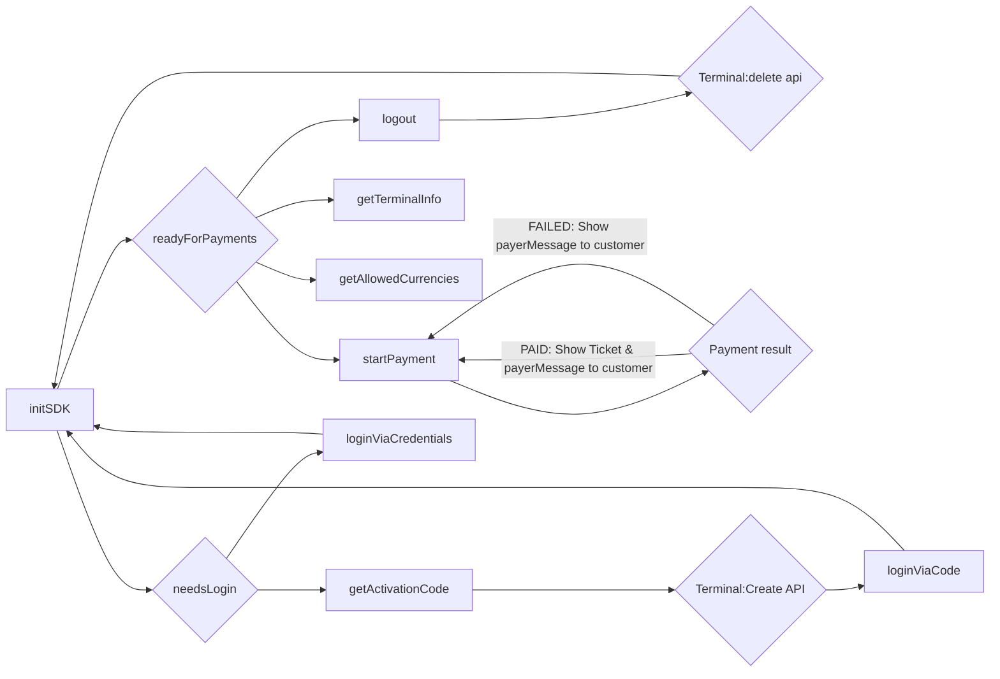

# PAY.POS SDK - iOS

### Requirements:

- iOS 18 or higher
- iPhone only (iPad not supported)
- Your project supports CocoaPods (swift package manager is comming)
- Make sure you have contacted PayNL support for an `integrationId` (required for initSDK)
- Make sure you have access to the `Tap to Pay on iPhone` entitlement
    - You can request this via [this form](https://developer.apple.com/contact/request/tap-to-pay-on-iphone/)

### Getting started

To get started, make sure your app is using cocoapods.
If not, create a `Podfile` at the root of your codebase.

Your `Podfile` needs to contain the following at minimum:

```ruby
# PAY.POS SDK requirement
platform :ios, 18.0
source 'https://github.com/CocoaPods/Specs.git'
source 'https://github.com/paynl/paynlSpec.git'

target 'MyApp' do
    project './MyApp.xcodeproj'
    pod 'PayNlPOSSdkSwift', '~> 1.0.0'
end
```

Also make sure the `Pods` project is added to your `MyApp.xcworkspace/contents.xcworkspacedata` file:

```xml
<?xml version="1.0" encoding="UTF-8"?>
<Workspace
        version="1.0">
    <FileRef
            location="group:MyApp.xcodeproj">
    </FileRef>
    <FileRef
            location="group:Pods/Pods.xcodeproj">
    </FileRef>
</Workspace>
```

> [!TIP]
> After setting up CocoaPods, make sure to run `pod install`.
>
> Also make sure you reopen your project with the `xcworkspace` file.
> You can use the following command `xed .` in the root to open your project with the correct file

### SDK flow



### API Spec

#### Init sdk

This function will initialize the SDK. It will return `PayNlInitResult` enum type. No parameters required

##### Example

```swift
import PayNlPOSSdkSwift

class PayNLService {
    private let posService: PosService
    init() {
        self.posService = PosService()
    }
    
    public func initSdk() async {
          let result = try await self.posService.initSdk(integrationId: '')
          switch result {
          case .needsLogin:
              // Start login flow
              break
          case .readyForPayment:
              // The SDK is ready to start payment
              break
          case .failed(let error):
            print("Failed to init SDK: \(error.code) - \(error.description)")
            break
          }
    }
}
```

#### Get activation code

> [!WARNING]
> Only use this if the `initSdk` method returned `.needsLogin`.
> Otherwise this method will log out this device and you will be forced to activate this activation code

This function will register this device and get an activation code to be activated
via [Terminals:create](https://developer.pay.nl/reference/post_terminals).
This function does not take parameters and has the following return type: `PayNlActivationResponse`:

| **Name**             | **Type** | **Description**                                               |
|----------------------|----------|---------------------------------------------------------------|
| `response`           | object   |                                                               |
| `response.code`      | String   | The activation code to be used in the `Terminals:create` call |
| `response.expiresAt` | Date     | This activation response is valid till this date              |

##### Example

```swift
import PayNlPOSSdkSwift

public func getActivationCode() async -> PayNlActivationResponse {
    do {
        return try await self.posService.getActivationCode()
    } catch {
        if let error = error as? PayNlSVError {
            print("Got error from SDK: \(error.code) - \(error.description)")
            return
        }
        
        print("Unknown error from PAY.POS sdk: \(error.localizedDescription)")
    }
}
```

#### loginViaCode

> [!NOTE]
> This method requires the usage of `getActivationCode`

> [!NOTE]
> After completing this method, you need to re-invoke the `initSdk` function

After using the `getActivationCode` and [Terminals:create](https://developer.pay.nl/reference/post_terminals), you can
use this `loginViaCode`.
It does not have a return type, but you need to provide the code from the `getActivationCode` to complete the login.

##### Example

```swift
import PayNlPOSSdkSwift

public func loginViaCode(code: String) async {
    do {
        try await self.posService.loginViaCode(code)
    } catch {
        if let error = error as? PayNlSVError {
            switch error {
            case .TERMINAL_NOT_ACTIVATED:
                print("This activation code has not been activated, please use the Terminals:create endpoint to activate the code...")
                return
            default:
                print("Got error from SDK: \(error.code) - \(error.description)")
                return
            }
        }
        
        print("Unknown error from PAY.POS sdk: \(error.localizedDescription)")
    }
}
```

#### loginViaCode

> [!WARNING]
> Only use this if the `initSdk` method returned `.needsLogin`.
> Otherwise this method will log out this device and reactivate using your account

> [!NOTE]
> After completing this method, you need to re-invoke the `initSdk` function

An alternative way to activate your device is via your PayNL account.
For this you need your a-code, service code, and service secret.

These codes can be found in the PayNL dashboard or using the
API: [Account:Me](https://developer.pay.nl/reference/accounts_me_get)
and [Merchant:info](https://developer.pay.nl/reference/merchants_info).

##### Example

```swift
import PayNlPOSSdkSwift

public func loginViaCredentials(aCode: String, serviceCode: String, serviceSecret: String) async {
    do {
        try await self.posService.loginViaCredentials(aCode, serviceCode, serviceSecret)
    } catch {
        if let error = error as? PayNlSVError {
            print("Got error from SDK: \(error.code) - \(error.description)")
            return
        }
        
        print("Unknown error from PAY.POS sdk: \(error.localizedDescription)")
    }
}
```

#### Get terminal info

With an activated terminal, you can fetch some basic information for reporting or other use cases.

The available information is the following:

| **Name**                      | **Type** | **Description**                                                                                         |
|-------------------------------|----------|---------------------------------------------------------------------------------------------------------|
| `terminalInfo`                | object   |                                                                                                         |
| `terminalInfo.terminal`       | object   |                                                                                                         |
| `terminalInfo.terminal.code`  | String   | The terminal code known at PayNL                                                                        |
| `terminalInfo.terminal.name`  | String   | The terminal name giving during activation                                                              |
| `terminalInfo.merchant`       | object   |                                                                                                         |
| `terminalInfo.merchant.code`  | String   | Your M-code known at PayNL                                                                              |
| `terminalInfo.merchant.name`  | String   | Your merchant's name                                                                                    |
| `terminalInfo.service`        | object   | If no service data is provided during payment, this will be the service the payment will be recorded to |
| `terminalInfo.service.code`   | String   | The SL-code known at PayNL                                                                              |
| `terminalInfo.service.name`   | String   | The service's name                                                                                      |
| `terminalInfo.tradeName`      | object   |                                                                                                         |
| `terminalInfo.tradeName.code` | String   | The TM-code for this terminal                                                                           |
| `terminalInfo.tradeName.name` | String   | The tradeName's name                                                                                    |

##### Example

```swift
import PayNlPOSSdkSwift

public func getTerminalInfo() {
    let data = self.posService.getTerminalInfo()
    guard let data = data else {
        print("This terminal is not activated...")
        return
    }
}
```

#### Get allowed currencies

With an activated terminal, you can fetch the allowed currencies this SDK supports:

| **Name**                   | **Type** | **Description**                                               |
|----------------------------|----------|---------------------------------------------------------------|
| `allowedCurrencies`        | Array    |                                                               |
| `allowedCurrencies[]`      | object   |                                                               |
| `allowedCurrencies[].id`   | String   | The ISO 4217 number of this currency (example: Euro -> "978") |
| `allowedCurrencies[].code` | String   | The ISO 4217 code of this currency (example: Euro -> "EUR")   |
| `allowedCurrencies[].sign` | String   | The sign of this currency (example Euro -> "€")               |

##### Example

```swift
import PayNlPOSSdkSwift

public func getAllowedCurrencies() {
    let data = self.posService.getAllowedCurrencies()
    guard let data = data else {
        print("This terminal is not activated...")
        return
    }
}
```

#### Start payment

With a fully activated terminal, you can start accepting and processing payments.
This function has 2 parameters:

| **Name**            | **Type** | **Description**                                                                                                                                                                   |
|---------------------|----------|-----------------------------------------------------------------------------------------------------------------------------------------------------------------------------------|
| `transaction`       | object   | The transaction that needs to be use for this payment. For more details about this object, please check out [order:create](https://developer.pay.nl/reference/api_create_order-1) |
| `service`           | object?  | A transaction can be re-routed to another service (within the same Merchant). NOTE: this is optional                                                                              |
| `service.serviceId` | String   | The service code (example: SL-1234-1234). A list of services can be requested via: [Merchant:info](https://developer.pay.nl/reference/merchants_info)                             |
| `service.secret`    | String   | The secret belonging to this service                                                                                                                                              |

This function returns the `PayNlTransactionResult` type:

| **Name**              | **Type**               | **Description**                                                                                                                                                                  |
|-----------------------|------------------------|----------------------------------------------------------------------------------------------------------------------------------------------------------------------------------|
| `result`              | object                 |                                                                                                                                                                                  |
| `result.statusAction` | PayNlTransactionStatus | The endresult of the transaction. Example: paid, failed                                                                                                                          |
| `result.payerMessage` | String                 | The message required to show on the UI. Example: `Betaling geslaagd`. Note: the language is determined by the user's card                                                        |
| `result.orderId`      | String                 | The orderId belonging to this transaction. Can be used to query the transaction in the [Transaction:info api](https://developer.pay.nl/reference/get_transactions-transactionid) |
| `result.reference`    | String?                | If provided, the SDK will echo back the provided reference in the transaction request                                                                                            |
| `result.ticket`       | String                 | A base64 encoded ticket. Only provided with a successful payment                                                                                                                 |

##### Example

```swift
import PayNlPOSSdkSwift

public func startPayment(transaction: PayNlTransaction, service: PayNlTransactionService?) async {
    do {
        let result = try await self.posService.startPayment(transaction, service)
        guard case .success = result.statusAction else {
            print("Failed to process payment. Reason: \(result.payerMessage)")
            return
        }
        
        print("Transaction processed and paid!")
        
        guard let ticketDecoded = Data(base64Encoded: result.ticket),
              let ticket = String(data: ticketDecoded, encoding: .utf8) else {
            print("No ticket data")
            return
        }
        
        print("Ticket:")
        print(ticket)
    } catch {
        if let error = error as? PayNlSVError {
            switch error {
            case .TRANSACTION_CANCELLED:
                print("Transaction cancelled...")
                return
            
            default:
                print("Got error from SDK: \(error.code) - \(error.description)")
                return
            }
        }
        
        print("Unknown error from PAY.POS sdk: \(error.localizedDescription)")
    }
}
```

#### Logout

> [!NOTE]
> This function will not de-activate your device in the PayNL portal
> You still need to call the [Terminals:delete api](https://developer.pay.nl/reference/delete_terminals-terminalcode)

Sometimes, it might be needed to log out/de-activate this terminal.
Reasons can be: A switch between merchants or this device will not be used for a while.

##### Example

```swift
import PayNlPOSSdkSwift

public func logout() {
    self.posService.logout()
}
```

#### Send logs

When encountering problems with the SDK, PayNL support needs the logs stored in the SDK.
To provide these logs, you can invoke the `sendLogs()` function

##### Example

```swift
import PayNlPOSSdkSwift

public func sendLogs() async {
    await self.posService.sendLogs()
}
```
