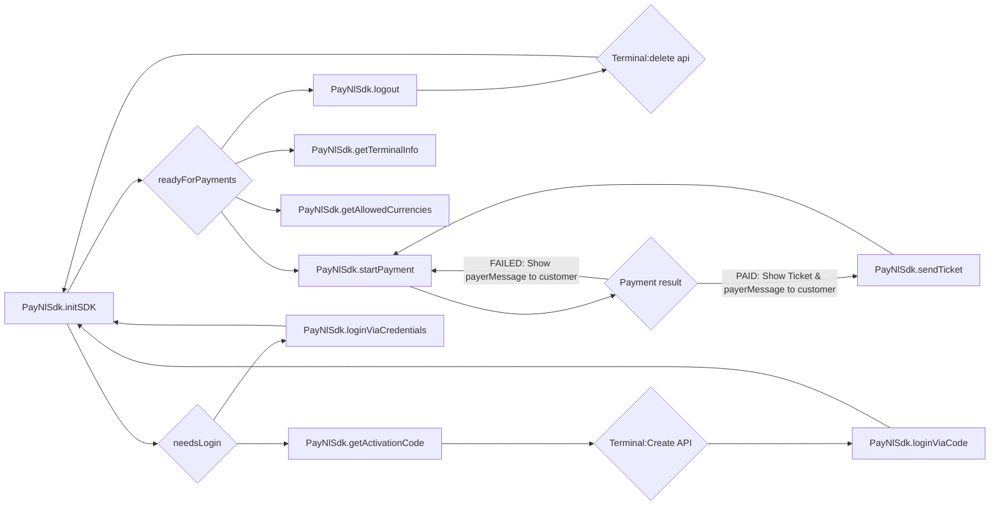

# PAY.POS SDK - React Native (Turbo module)

### Requirements

- React native using Old and New Architecture
- Make sure you have contacted PayNL support for an `integrationId` (required for initSDK)
- Make sure you have the requirements for [iOS](./sdk-ios.md#requirements)
- Make sure you have the requirements for [Android softpos](./sdk-android-softpos.md#requirements)

### Getting started

#### iOS Setup

> [!NOTE]
> If you are not planning to support Tap to Pay on iPhone, you can skip this

Update your `Podfile` adding the PayNL Spec repository:

```ruby
...

platform :ios, 18.0
source 'https://github.com/CocoaPods/Specs.git'
source 'https://github.com/paynl/paynlSpec.git'

target 'MyApp' do
...
```

#### Android setup

> [!NOTE]
> If you are not planning to support Android softpos, you can skip this

First make sure you have the PayNL gradle repositories in your global gradle properties:

- MacOS: `~/.gradle/gradle.properties`
- Windows: `USER_HOME/.gradle/gradle.properties`

```
# Pay.POS SDK registry credentials
PAYNL_REGISTRY_LOGIN=...
PAYNL_REGISTRY_TOKEN=...

# Github personal access token with read:packages scope
GITHUB_USERNAME=...
GITHUB_PERSONAL_TOKEN=...
```

Last, go to your `android/build.gradle` and add the following repositories:

```groovy
allprojects {
    repositories {
       google()
       mavenCentral()
       
       // ---- These two need to be added ----
       maven {
        name = "PayNLRegistry"
        url = uri("https://maven.pkg.github.com/paynl/pos-sdk")
        credentials {
          username = project.GITHUB_USERNAME
          password = project.GITHUB_PERSONAL_TOKEN
        }
      }
       maven {
        name = "PayNLMavenClientRegistry"
        url = uri("https://maven.pkg.github.com/theminesec/ms-registry-client")
        credentials {
          username = project.PAYNL_REGISTRY_LOGIN
          password = project.PAYNL_REGISTRY_TOKEN
        }
      }
      // ---- END ----
    }
}
```

#### React native

Make sure you have a `.npmrc`-file containing to following at minimum at the same level as your
`package.json`:

```
@paynl:registry=https://npm.pkg.github.com
```

Now, we can install the package via:

```bash
npm i @paynl/pos-sdk-react-native

# Skip these if you do not develop for iOS
cd ios
pod install
```

### SDK flow



### API Spec

#### Init sdk

This function will initialize the SDK. It will return `PayNlInitResult` enum type.

| **Name**                            | **Type**             | **Description**                                                                                                                                                                                                                                                              |
|-------------------------------------|----------------------|------------------------------------------------------------------------------------------------------------------------------------------------------------------------------------------------------------------------------------------------------------------------------|
| integrationId                       | string               | The UUID received from PayNL support in order to process payments                                                                                                                                                                                                            |
| licenseName                         | string               | The name of the license file in your assets folder                                                                                                                                                                                                                           |
| overlayParams                       | PaymentOverlayParams | Using these params you can configure the overlay during a payment (Opt-out feature)                                                                                                                                                                                          |
| overlayParams.enabled               | boolean              | The enables/disables the overlay (default: `true`)                                                                                                                                                                                                                           |
| overlayParams.closeDelayInMs        | number               | Configures an auto close delay on the overlay (default: 0 -> Keep open)                                                                                                                                                                                                      |
| overlayParams.logoImage             | string               | The filename for your logo. Make sure the file is placed in the drawable folder (default: `paynl.xml` -> The PayNL logo)                                                                                                                                                     |
| overlayParams.waitingCardAnimation  | string               | The filename for a lottie json animation shown while waiting for NFC detection. Make sure your [lottie json](http://airbnb.io/lottie/#/android?id=from-resraw-lottie_rawres-or-assets-lottie_filename) is in the raw folder (default: `reader_animation.json`)               |
| overlayParams.buttonShape           | string               | The filename for a custom background shape for the buttons in the overlay. Make sure the file is placed in the drawable folder (Default: pay_btn.xml)                                                                                                                        |
| overlayParams.progressBarColor      | string               | The color of the loading spinner during processing of Payment. Hex-only (default: `#FF585FFF`)                                                                                                                                                                               |
| overlayParams.successColor          | string               | The color of the success check when payment is success. Hex-only (default: `#FF00D388`)                                                                                                                                                                                      |
| overlayParams.errorColor            | string               | The color of error during payment. Hex-only (default: `#FFC5362C`)                                                                                                                                                                                                           |
| overlayParams.backgroundColor       | string               | The background color of the overlay & ticket viewer. Hex-only (default: `#FFFFFFFF`)                                                                                                                                                                                         |
| overlayParams.amountTextColor       | string               | The text color of the amount. Hex-only (default: `#FF444444`)                                                                                                                                                                                                                |
| overlayParams.payerMessageTextColor | string               | The text color of the payerMessage. Hex-only (default: `#FF888888`)                                                                                                                                                                                                          |
| overlayParams.buttonTextColor       | string               | The text color of the buttons. Hex-only (default: `#FF000000`)                                                                                                                                                                                                               |
| overlayParams.cancelButtonLabel     | string               | The label text on the cancel button (default: `Annuleren`)                                                                                                                                                                                                                   |
| overlayParams.closeButtonLabel      | string               | The label text on the close button (default: `Sluiten`)                                                                                                                                                                                                                      |
| overlayParams.waitingCardLabel      | string               | The label text while waiting for NFC detection (default: `Bied uw kaart aan`)                                                                                                                                                                                                |
| overlayParams.processingCardLabel   | string               | The label text while processing payment (default: `Betaling verwerken...`)                                                                                                                                                                                                   |
| overlayParams.ticketHeaderLabel     | string               | The label text for the ticket viewer header (default: `Betaling succesvol!`)                                                                                                                                                                                                 |
| overlayParams.emailHeaderLabel      | string               | The label text for the email ticket header (default: `Voer email adres in`)                                                                                                                                                                                                  |
| overlayParams.emailButtonLabel      | string               | The label text for the send ticket button (default: `Mailen`)                                                                                                                                                                                                                |
| useExternalDisplayIfAvailable       | boolean              | (Android only) This will make sure the overlay and PIN prompt is show on the secondary screen, if a secondary screen is available (default: `true`)                                                                                                                          |
| enableSound                         | boolean              | (Android only) During a transaction, some user feedback is required to improve the User Experience. Example are: NFC scan beep or payment success beep. The SDK has a build-in tone generator which uses the phone's volume to generate the correct sounds (default: `true`) |
| enableLogging                       | boolean              | If problems occure, PayNL support needs logs from the SDK to help you out. This feature can be disabled for minor performance improvements, BUT NO SUPPORT CAN BE GIVEN IF THIS FEATURE IS DISABLED (default: `true`)                                                        |

##### Example

```ts
import {Platform} from 'react-native';
import {PayNlSdk} from '@paynl/pos-sdk-react-native';

class PayNLService {
    async initSdk() {
        const result = await PayNlSdk.initSdk({
            integrationId: Platform.select({
                ios: '',
                default: !__DEV__ ? 'PRODUCTION_ID' : 'DEVELOPMENT_ID',
            }),
            licenseName: '', // Required for Android softpos
        });

        switch (result) {
            case 'needs_login':
                // Start login flow and reinitialized the SDK
                return;

            case 'ready_for_payment':
                // The SDK is ready to start payment
                return;

            case 'failed':
                // Failed to init SDK. Please consult logs or contact PayNL support
                return;
        }
    }
}
```

#### Get activation code

> [!WARNING]
> Only use this if the `initSdk` method returned `needs_login`.
> Otherwise this method will log out this device and you will be forced to activate this activation code

This function will register this device and get an activation code to be activated
via [Terminals:create](https://developer.pay.nl/reference/post_terminals).
This function does not take parameters and has the following return type: `PayNlActivationResponse`:

| **Name**             | **Type** | **Description**                                               |
|----------------------|----------|---------------------------------------------------------------|
| `response`           | object   |                                                               |
| `response.code`      | string   | The activation code to be used in the `Terminals:Create` call |
| `response.expiresAt` | number   | This activation response is valid till this unix timestamp    |

##### Example

```ts
import {PayNlSdk} from '@paynl/pos-sdk-react-native';

class PayNLService {
    async getActivationCode() {
        try {
            const response = await PayNlSdk.getActivationCode();
            // Call Terminal:Create API
        } catch (e) {
            console.error(`Error from PAY.POS sdk: ${error}`)
        }
    }
}
```

#### loginViaCode

> [!NOTE]
> This method requires the usage of `getActivationCode`

> [!NOTE]
> After completing this method, you need to re-invoke the `initSdk` function

After using the `getActivationCode` and [Terminals:create](https://developer.pay.nl/reference/post_terminals), you can
use this `loginViaCode`.
It does not have a return type, but you need to provide the code from the `getActivationCode` to complete the login.

##### Example

```ts
import {PayNlSdk} from '@paynl/pos-sdk-react-native';

class PayNLService {
    async loginViaCode(code: string) {
        try {
            await PayNlSdk.loginViaCode(code);
        } catch (e) {
            console.error(`Error from PAY.POS sdk: ${error}`)
        }
    }
}
```

#### loginViaCode

> [!WARNING]
> Only use this if the `initSdk` method returned `.needsLogin`.
> Otherwise this method will log out this device and reactivate using your account

> [!NOTE]
> After completing this method, you need to re-invoke the `initSdk` function

An alternative way to activate your device is via your PayNL account.
For this you need your a-code, service code, and service secret.

These codes can be found in the PayNL dashboard or using the
API: [Account:Me](https://developer.pay.nl/reference/accounts_me_get)
and [Merchant:info](https://developer.pay.nl/reference/merchants_info).

##### Example

```ts
import {PayNlSdk} from '@paynl/pos-sdk-react-native';

class PayNLService {
    async loginViaCredentials(aCode: string, serviceCode: string, serviceSecret: string) {
        try {
            await PayNlSdk.loginViaCredentials(aCode, serviceCode, serviceSecret);
        } catch (e) {
            console.error(`Error from PAY.POS sdk: ${error}`)
        }
    }
}
```

#### Get terminal info

With an activated terminal, you can fetch some basic information for reporting or other use cases.

The available information is the following:

| **Name**                      | **Type** | **Description**                                                                                         |
|-------------------------------|----------|---------------------------------------------------------------------------------------------------------|
| `terminalInfo`                | object?  |                                                                                                         |
| `terminalInfo.terminal`       | object   |                                                                                                         |
| `terminalInfo.terminal.code`  | string   | The terminal code known at PayNL                                                                        |
| `terminalInfo.terminal.name`  | string   | The terminal name giving during activation                                                              |
| `terminalInfo.merchant`       | object   |                                                                                                         |
| `terminalInfo.merchant.code`  | string   | Your M-code known at PayNL                                                                              |
| `terminalInfo.merchant.name`  | string   | Your merchant's name                                                                                    |
| `terminalInfo.service`        | object   | If no service data is provided during payment, this will be the service the payment will be recorded to |
| `terminalInfo.service.code`   | string   | The SL-code known at PayNL                                                                              |
| `terminalInfo.service.name`   | string   | The service's name                                                                                      |
| `terminalInfo.tradeName`      | object   |                                                                                                         |
| `terminalInfo.tradeName.code` | string   | The TM-code for this terminal                                                                           |
| `terminalInfo.tradeName.name` | string   | The tradeName's name                                                                                    |

##### Example

```ts
import {PayNlSdk, type TerminalInfo} from '@paynl/pos-sdk-react-native';

class PayNLService {
    getTerminalInfo(): TerminalInfo | undefined {
        try {
            const info = PayNlSdk.getTerminalInfo();
            if (!info) {
                console.error('This terminal is not activated...')
                return undefined;
            }

            return info;
        } catch (e) {
            console.error(`Error from PAY.POS sdk: ${error}`);
            return undefined;
        }
    }
}
```

#### Get allowed currencies

With an activated terminal, you can fetch the allowed currencies this SDK supports:

| **Name**                   | **Type** | **Description**                                               |
|----------------------------|----------|---------------------------------------------------------------|
| `allowedCurrencies`        | array?   |                                                               |
| `allowedCurrencies[]`      | object   |                                                               |
| `allowedCurrencies[].id`   | string   | The ISO 4217 number of this currency (example: Euro -> "978") |
| `allowedCurrencies[].code` | string   | The ISO 4217 code of this currency (example: Euro -> "EUR")   |
| `allowedCurrencies[].sign` | string   | The sign of this currency (example Euro -> "€")               |

##### Example

```ts
import {PayNlSdk, type AllowedCurrency} from '@paynl/pos-sdk-react-native';

class PayNLService {
    getTerminalInfo(): AllowedCurrency[] | undefined {
        try {
            const currencies = PayNlSdk.getAllowedCurrencies();
            if (!currencies || currencies.length === 0) {
                console.error('This terminal is not activated...')
                return undefined;
            }

            return currencies;
        } catch (e) {
            console.error(`Error from PAY.POS sdk: ${error}`)
            return undefined;
        }
    }
}
```

#### Start payment

With a fully activated terminal, you can start accepting and processing payments.
This function has 2 parameters:

| **Name**            | **Type** | **Description**                                                                                                                                                                   |
|---------------------|----------|-----------------------------------------------------------------------------------------------------------------------------------------------------------------------------------|
| `transaction`       | object   | The transaction that needs to be use for this payment. For more details about this object, please check out [order:create](https://developer.pay.nl/reference/api_create_order-1) |
| `service`           | object?  | A transaction can be re-routed to another service (within the same Merchant). NOTE: this is optional                                                                              |
| `service.serviceId` | string   | The service code (example: SL-1234-1234). A list of services can be requested via: [Merchant:info](https://developer.pay.nl/reference/merchants_info)                             |
| `service.secret`    | string   | The secret belonging to this service                                                                                                                                              |

This function returns the `PayNlTransactionResult` type:

| **Name**              | **Type**               | **Description**                                                                                                                                                                  |
|-----------------------|------------------------|----------------------------------------------------------------------------------------------------------------------------------------------------------------------------------|
| `result`              | object                 |                                                                                                                                                                                  |
| `result.statusAction` | PayNlTransactionStatus | The endresult of the transaction. Example: paid, failed                                                                                                                          |
| `result.payerMessage` | string                 | The message required to show on the UI. Example: `Betaling geslaagd`. Note: the language is determined by the user's card                                                        |
| `result.orderId`      | string                 | The orderId belonging to this transaction. Can be used to query the transaction in the [Transaction:info api](https://developer.pay.nl/reference/get_transactions-transactionid) |
| `result.reference`    | string?                | If provided, the SDK will echo back the provided reference in the transaction request                                                                                            |
| `result.ticket`       | string                 | A base64 encoded ticket. Only provided with a successful payment                                                                                                                 |

##### Example

```ts
import {PayNlSdk, type Transaction, type Service} from '@paynl/pos-sdk-react-native';
// React Native does not have a Base64 decoder build-in
import {Buffer} from 'buffer';

class PayNLService {
    async startPayment(transaction: Transaction, service?: Service) {
        try {
            const result = await PayNlSdk.startPayment({transaction, service});
            if (result.statusAction !== 'PAID') {
                console.error(`Failed to process payment. Reason: ${result.payerMessage}`);
                return;
            }

            let ticket = '';
            if (result.ticket !== '') {
                const buff = new Buffer(result.ticket, 'base64');
                ticket = buff.tostring('ascii');
            }

            console.log(JSON.stringify(result));
            console.log('Ticket:')
            console.log(ticket)
        } catch (e) {
            console.error(`Error from PAY.POS sdk: ${error}`)
        }
    }
}
```

##### Events

During a transaction, it is possible to receive events.
These events could be used to render/animate your on view.

| **Event**            | **Data**                               | **Description**                                                                                               |
|----------------------|----------------------------------------|---------------------------------------------------------------------------------------------------------------|
| PAYMENT_WAITING_CARD | null                                   | The SDK is ready to scan payment card                                                                         |
| PAYMENT_PROCESSING   | null                                   | The SDK has successfully scanned the card and has send the payment for processing                             |
| PAYMENT_COMPLETED    | null                                   | The SDK has successfully processed the payment and amount has been paid                                       |
| PAYMENT_FAILED       | {"code": "SV-xxxx", "description": ""} | The SDK has failed to process the payment. Please review the data to see why                                  |
| PIN_WAITING          | {"usingSecondaryScreen":"true\|false"} | The SDK is waiting for the pincode of the customer. Please note that `usingSecondaryScreen` is of type String |
| PIN_CANCELLED        | null                                   | The pincode input has been cancelled. The transaction itself is also cancelled                                |

```js
import {NativeEventEmitter, NativeModules} from 'react-native';
import {PayNlSdk} from '@paynl/pos-sdk-react-native';

class PayNLService {
    setPaymentListener() {
        // Old architecture
        const eventEmitter = new NativeEventEmitter(NativeModules.PayNlSdk);
        eventEmitter.addListener('onPaymentEvent', (data) => {
            console.log('paymentEvent', JSON.stringify(data));
        });

        // New architecture
        PayNlSdk.onPaymentEvent((data) => {
            console.log('paymentEvent', JSON.stringify(data));
        });
    }
}
```

#### Send ticket via E-mail

After a succesfull transaction, it is possible to send the ticket via e-mail to someone else.
For this, you need the transactionId (MV-code), the ticket self (both received after startTransaction), and the user's
E-mail address

##### Example

```js
import {PayNlSdk, type Transaction} from '@paynl/pos-sdk-react-native';

class PayNLService {
    async sendTicket(email: string, transaction: Transaction) {
        try {
            await PayNlSdk.sendTicket(email, transaction.transactionId, transaction.ticket);
        } catch (e) {
            console.error(`Error from PAY.POS sdk: ${error}`)
        }
    }
}
```

#### Logout

> [!NOTE]
> This function will not de-activate your device in the PayNL portal
> You still need to call the [Terminals:delete api](https://developer.pay.nl/reference/delete_terminals-terminalcode)

Sometimes, it might be needed to log out/de-activate this terminal.
Reasons can be: A switch between merchants or this device will not be used for a while.

##### Example

```ts
import {PayNlSdk} from '@paynl/pos-sdk-react-native';

class PayNLService {
    logout() {
        PayNlSdk.logout();
    }
}
```

#### Send logs

> [!NOTE]
> ANDROID ONLY: Pressing 5x on the logo in the overlay will also trigger this function (if `enabledLogging = true`)

When encountering problems with the SDK, PayNL support needs the logs stored in the SDK.
To provide these logs, you can invoke the `sendLogs()` function

##### Example

```ts
import {PayNlSdk} from '@paynl/pos-sdk-react-native';

class PayNLService {
    async sendLogs() {
        await PayNlSdk.sendLogs();
    }
}
```
