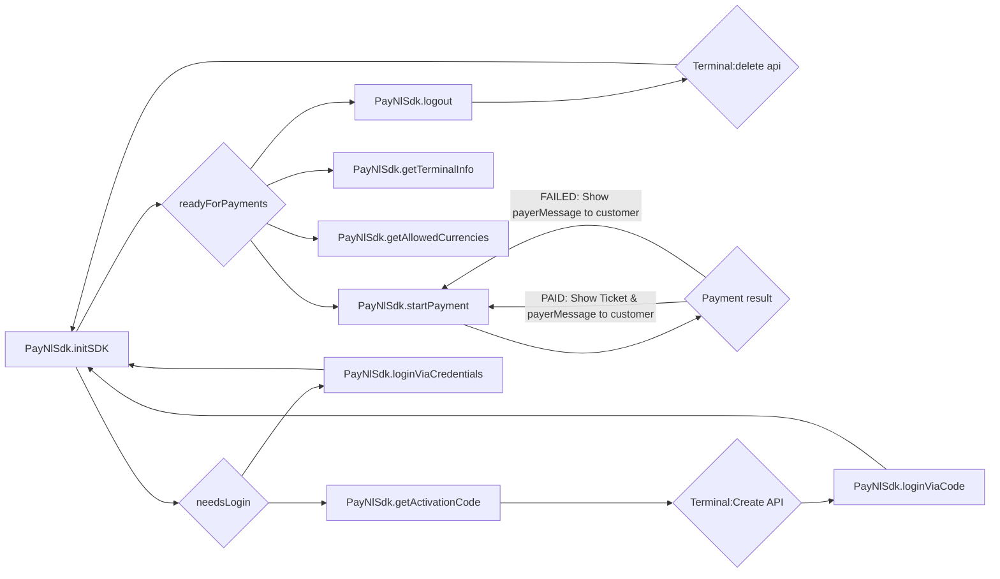

# PAY.POS SDK - React Native (Turbo module)

> [!WARNING]
> Currenty, this package only support iOS. Android is in development

### Requirements

- React native using new architecture (Turbo modules)
- iOS 18 or higher
- Make sure you have contacted PayNL support for an `integrationId`
- Make sure you have access to the `Tap to Pay on iPhone` entitlement
    - You can request this via [this form](https://developer.apple.com/contact/request/tap-to-pay-on-iphone/)

### Getting started

To get started, make sure you have a `.npmrc`-file containing to following at minimum at the same level as your
`package.json`:

```
@paynl:registry=https://npm.pkg.github.com
```

Next, update your `Podfile` adding the PayNL Spec repository:

```ruby
...

platform :ios, 18.0
source 'https://github.com/CocoaPods/Specs.git'
source 'https://github.com/paynl/paynlSpec.git'

target 'MyApp' do
...
```

Now, we can install the package via:

```bash
npm i @paynl/pos-sdk-react-native
cd ios
pod install
```

### SDK flow



### API Spec

#### Init sdk

This function will initialize the SDK. It will return `PayNlInitResult` enum type. No parameters required

##### Example

```ts
import {PayNlSdk} from '@paynl/pos-sdk-react-native';

class PayNLService {
    async initSdk() {
        try {
            const result = await PayNlSdk.initSdk();
            if (result === 'needs_login') {
                // Start login flow and reinitialized the SDK
                return;
            }

            // The SDK is ready to start payment
        } catch (error) {
            console.error(`Error from PAY.POS sdk: ${error}`)
        }
    }
}
```

#### Get activation code

> [!WARNING]
> Only use this if the `initSdk` method returned `needs_login`.
> Otherwise this method will log out this device and you will be forced to activate this activation code

This function will register this device and get an activation code to be activated
via [Terminals:create](https://developer.pay.nl/reference/post_terminals).
This function does not take parameters and has the following return type: `PayNlActivationResponse`:

| **Name**             | **Type** | **Description**                                               |
|----------------------|----------|---------------------------------------------------------------|
| `response`           | object   |                                                               |
| `response.code`      | string   | The activation code to be used in the `Terminals:Create` call |
| `response.expiresAt` | number   | This activation response is valid till this unix timestamp    |

##### Example

```ts
import {PayNlSdk} from '@paynl/pos-sdk-react-native';

class PayNLService {
    async getActivationCode() {
        try {
            const response = await PayNlSdk.getActivationCode();
            // Call Terminal:Create API
        } catch (e) {
            console.error(`Error from PAY.POS sdk: ${error}`)
        }
    }
}
```

#### loginViaCode

> [!NOTE]
> This method requires the usage of `getActivationCode`

> [!NOTE]
> After completing this method, you need to re-invoke the `initSdk` function

After using the `getActivationCode` and [Terminals:create](https://developer.pay.nl/reference/post_terminals), you can
use this `loginViaCode`.
It does not have a return type, but you need to provide the code from the `getActivationCode` to complete the login.

##### Example

```ts
import {PayNlSdk} from '@paynl/pos-sdk-react-native';

class PayNLService {
    async loginViaCode(code: string) {
        try {
            await PayNlSdk.loginViaCode(code);
        } catch (e) {
            console.error(`Error from PAY.POS sdk: ${error}`)
        }
    }
}
```

#### loginViaCode

> [!WARNING]
> Only use this if the `initSdk` method returned `.needsLogin`.
> Otherwise this method will log out this device and reactivate using your account

> [!NOTE]
> After completing this method, you need to re-invoke the `initSdk` function

An alternative way to activate your device is via your PayNL account.
For this you need your a-code, service code, and service secret.

These codes can be found in the PayNL dashboard or using the
API: [Account:Me](https://developer.pay.nl/reference/accounts_me_get)
and [Merchant:info](https://developer.pay.nl/reference/merchants_info).

##### Example

```ts
import {PayNlSdk} from '@paynl/pos-sdk-react-native';

class PayNLService {
    async loginViaCredentials(aCode: string, serviceCode: string, serviceSecret: string) {
        try {
            await PayNlSdk.loginViaCredentials(aCode, serviceCode, serviceSecret);
        } catch (e) {
            console.error(`Error from PAY.POS sdk: ${error}`)
        }
    }
}
```

#### Get terminal info

With an activated terminal, you can fetch some basic information for reporting or other use cases.

The available information is the following:

| **Name**                      | **Type** | **Description**                                                                                         |
|-------------------------------|----------|---------------------------------------------------------------------------------------------------------|
| `terminalInfo`                | object?  |                                                                                                         |
| `terminalInfo.terminal`       | object   |                                                                                                         |
| `terminalInfo.terminal.code`  | string   | The terminal code known at PayNL                                                                        |
| `terminalInfo.terminal.name`  | string   | The terminal name giving during activation                                                              |
| `terminalInfo.merchant`       | object   |                                                                                                         |
| `terminalInfo.merchant.code`  | string   | Your M-code known at PayNL                                                                              |
| `terminalInfo.merchant.name`  | string   | Your merchant's name                                                                                    |
| `terminalInfo.service`        | object   | If no service data is provided during payment, this will be the service the payment will be recorded to |
| `terminalInfo.service.code`   | string   | The SL-code known at PayNL                                                                              |
| `terminalInfo.service.name`   | string   | The service's name                                                                                      |
| `terminalInfo.tradeName`      | object   |                                                                                                         |
| `terminalInfo.tradeName.code` | string   | The TM-code for this terminal                                                                           |
| `terminalInfo.tradeName.name` | string   | The tradeName's name                                                                                    |

##### Example

```ts
import {PayNlSdk, type TerminalInfo} from '@paynl/pos-sdk-react-native';

class PayNLService {
    getTerminalInfo(): TerminalInfo | undefined {
        try {
            const info = PayNlSdk.getTerminalInfo();
            if (!info) {
                console.error('This terminal is not activated...')
                return undefined;
            }

            return info;
        } catch (e) {
            console.error(`Error from PAY.POS sdk: ${error}`);
            return undefined;
        }
    }
}
```

#### Get allowed currencies

With an activated terminal, you can fetch the allowed currencies this SDK supports:

| **Name**                   | **Type** | **Description**                                             |
|----------------------------|----------|-------------------------------------------------------------|
| `allowedCurrencies`        | array?   |                                                             |
| `allowedCurrencies[]`      | object   |                                                             |
| `allowedCurrencies[].id`   | string   | The ISO 4217 num of this currency (example: Euro -> "978")  |
| `allowedCurrencies[].code` | string   | The ISO 4217 code of this currency (example: Euro -> "EUR") |
| `allowedCurrencies[].sign` | string   | The sign of this currency (example Euro -> "€")             |

##### Example

```ts
import {PayNlSdk, type AllowedCurrency} from '@paynl/pos-sdk-react-native';

class PayNLService {
    getTerminalInfo(): AllowedCurrency[] | undefined {
        try {
            const currencies = PayNlSdk.getAllowedCurrencies();
            if (!currencies || currencies.length === 0) {
                console.error('This terminal is not activated...')
                return undefined;
            }

            return currencies;
        } catch (e) {
            console.error(`Error from PAY.POS sdk: ${error}`)
            return undefined;
        }
    }
}
```

#### Start payment

With a fully activated terminal, you can start accepting and processing payments.
This function has 2 parameters:

| **Name**            | **Type** | **Description**                                                                                                                                                                   |
|---------------------|----------|-----------------------------------------------------------------------------------------------------------------------------------------------------------------------------------|
| `transaction`       | object   | The transaction that needs to be use for this payment. For more details about this object, please check out [order:create](https://developer.pay.nl/reference/api_create_order-1) |
| `service`           | object?  | A transaction can be re-routed to another service (within the same Merchant). NOTE: this is optional                                                                              |
| `service.serviceId` | String   | The service code (example: SL-1234-1234). A list of services can be requested via: [Merchant:info](https://developer.pay.nl/reference/merchants_info)                             |
| `service.secret`    | String   | The secret belonging to this service                                                                                                                                              |

This function returns the `PayNlTransactionResult` type:

| **Name**              | **Type**               | **Description**                                                                                                                                                                  |
|-----------------------|------------------------|----------------------------------------------------------------------------------------------------------------------------------------------------------------------------------|
| `result`              | object                 |                                                                                                                                                                                  |
| `result.statusAction` | PayNlTransactionStatus | The endresult of the transaction. Example: paid, failed                                                                                                                          |
| `result.payerMessage` | String                 | The message required to show on the UI. Example: `Betaling geslaagd`. Note: the language is determined by the user's card or the `Accept-Language` header                        |
| `result.orderId`      | String                 | The orderId belonging to this transaction. Can be used to query the transaction in the [Transaction:info api](https://developer.pay.nl/reference/get_transactions-transactionid) |
| `result.reference`    | String?                | If provided, the SDK will echo back the provided reference in the transaction request                                                                                            |
| `result.ticket`       | String                 | A base64 encoded ticket. Only provided with a successful payment                                                                                                                 |

##### Example

```ts
import {PayNlSdk, type Transaction, type Service} from '@paynl/pos-sdk-react-native';
// React Native does not have a Base64 decoder build-in
import {Buffer} from 'buffer';

class PayNLService {
    async startPayment(transaction: Transaction, service?: Service) {
        try {
            const result = await PayNlSdk.startPayment({transaction, service});
            if (result.statusAction !== 'PAID') {
                console.error(`Failed to process payment. Reason: ${result.payerMessage}`);
                return;
            }

            let ticket = '';
            if (result.ticket !== '') {
                const buff = new Buffer(result.ticket, 'base64');
                ticket = buff.toString('ascii');
            }

            console.log(JSON.stringify(result));
            console.log('Ticket:')
            console.log(ticket)
        } catch (e) {
            console.error(`Error from PAY.POS sdk: ${error}`)
        }
    }
}
```

#### Logout

> [!NOTE]
> This function will not de-activate your device in the PayNL portal
> You still need to call the [Terminals:delete api](https://developer.pay.nl/reference/delete_terminals-terminalcode)

Sometimes, it might be needed to log out/de-activate this terminal.
Reasons can be: A switch between merchants or this device will not be used for a while.

##### Example

```ts
import {PayNlSdk} from '@paynl/pos-sdk-react-native';

class PayNLService {
    logout() {
        PayNlSdk.logout();
    }
}
```

#### Send logs

When encountering problems with the SDK, PayNL support needs the logs stored in the SDK.
To provide these logs, you can invoke the `sendLogs()` function

##### Example

```ts
import {PayNlSdk} from '@paynl/pos-sdk-react-native';

class PayNLService {
    async sendLogs() {
        await PayNlSdk.sendLogs();
    }
}
```
